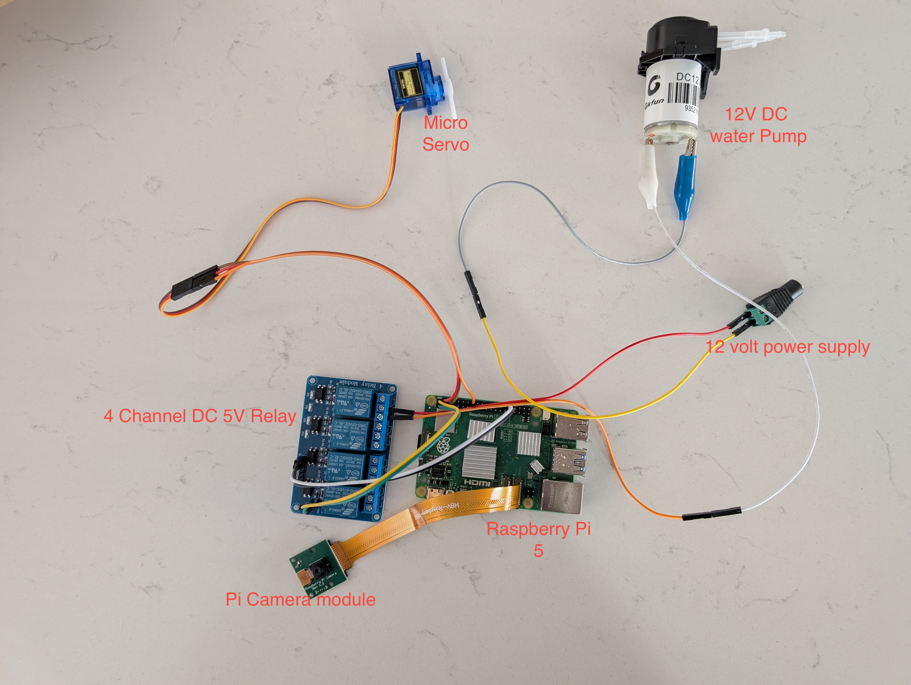

# CAT Counter Attack Turret (CAT)

## Overview
The CAT Counter Attack Turret is an automated cat deterrent system that uses computer vision and a water spray mechanism to keep cats away from protected areas. The system runs on a Raspberry Pi and operates autonomously once installed.

## Core Functionality
The `cat_deterrent.py` control software provides the following features:

- Continuous monitoring via camera (2-second intervals)
- AI-powered cat detection using neural network inference
- Automated aiming system (currently basic panning motion)
- Water spray activation upon cat detection
- Email notifications with captured images

## Current Limitations & Future Improvements
- Basic panning motion (oscillates between extremes)
- Future iterations will include:
  - Upgraded servos for full articulation
  - Enhanced CNN for precise location targeting
  - Centered aiming based on cat position in frame

## Installation

### 1. Copy Control Software
Create directory if it doesn't exist

```bash

sudo mkdir -p /home/pi/CAT_CounterAttackTurret/control_software
Copy the script
sudo cp cat_deterrent.py /home/pi/CAT_CounterAttackTurret/control_software/
bash
sudo nano /etc/systemd/system/cat_deterrent.service
```
To enable and start the service:
```bash
sudo systemctl enable cat_deterrent.service
sudo systemctl start cat_deterrent.service
```
To check the status of the service:
```bash
sudo systemctl status cat_deterrent.service
```
To view the logs:
journalctl -u cat_deterrent.service


