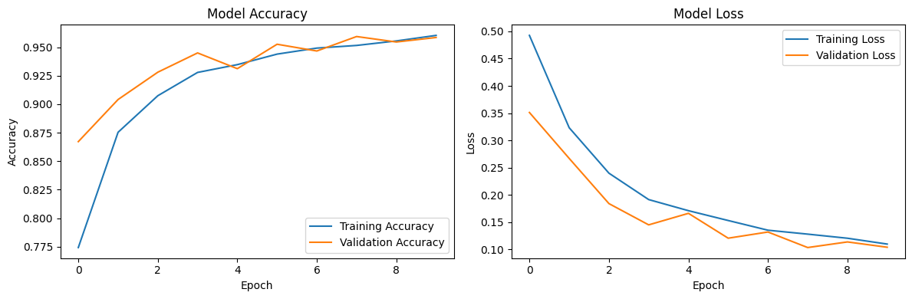

# CAT Model Training

This notebook trains a binary image classifier to detect cats in images. The model is designed to run on a Raspberry Pi as part of the Counter Attack Turret (CAT) project.

## Prerequisites

- NVIDIA GPU with CUDA support
- Python 3.8+
- TensorFlow 2.x
- CUDA Toolkit and cuDNN

## Setup

1. Run the CUDA setup script to configure the environment:# CAT Model Training

This notebook trains a binary image classifier to detect cats in images. The model is designed to run on a Raspberry Pi as part of the Counter Attack Turret (CAT) project.

## Prerequisites

- NVIDIA GPU with CUDA support
- Python 3.8+
- TensorFlow 2.x
- CUDA Toolkit and cuDNN

## Setup

1. Run the CUDA setup script to configure the environment:

2. Install required packages:

## Dataset

The training data combines two sources:
- Cat images from [dataset source]
- Non-cat (house) images from [dataset source]

Data structure:

## Model Outputs

The trained model is saved in two formats:
- `pet_classifier_model.h5` - Full TensorFlow model format
- `pet_classifier_model.tflite` - TensorFlow Lite format for Raspberry Pi deployment

Note: The .tflite version requires TF Select ops support when running on the Raspberry Pi.

## Training

The notebook achieves ~95% accuracy on both training and validation sets. Training utilizes GPU acceleration for faster processing.

## Training Results

Below is the model's training history showing accuracy and loss metrics over epochs:

